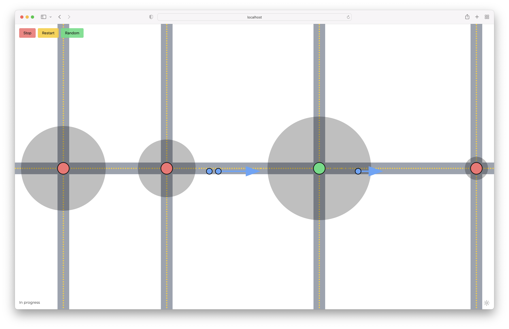
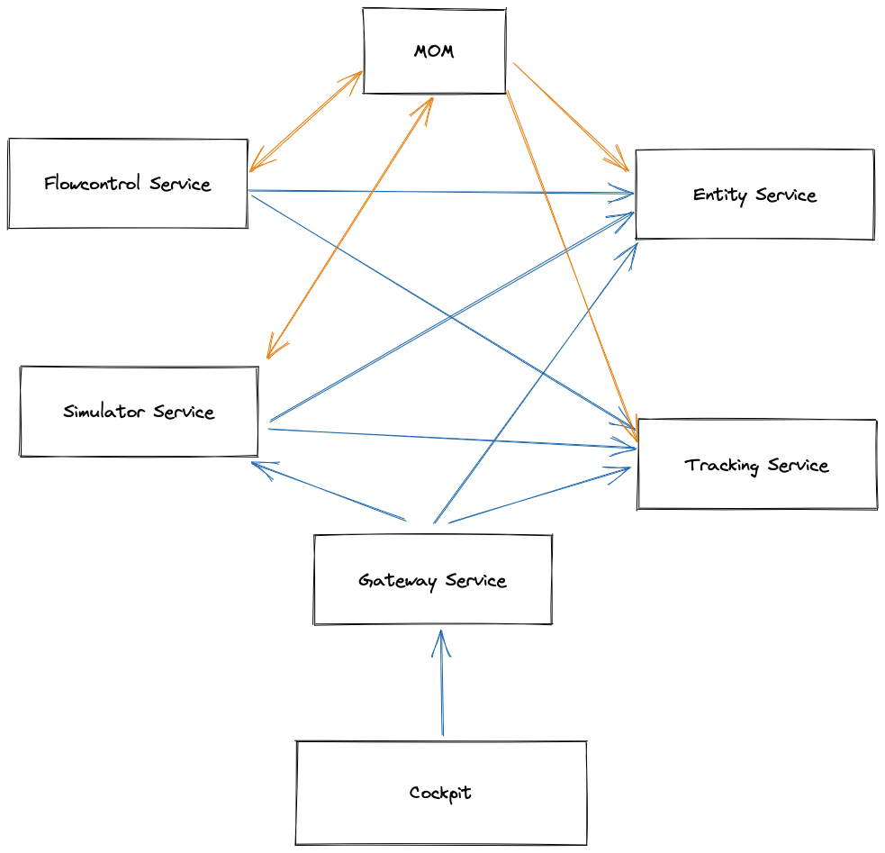

# FastV2I

> Project completed in the course Distributed Systems Engineering Lecture 2022 - Vienna University of Technology, Dr.
> Johannes Weidl-Rektenwald



FastV2I is a visual simulation software that allows you to simulate vehicles and traffic lights in a given
configuration. The cars aim to minimize the amount of standing time in front of red traffic lights. To do so a
sophisticated flow control algorithm tells the car what speed it should drive.

## Quick Architecture Overview

The project is developed using a microservice architecture. The service consists out of 6 Microservices:

1. _Gateway Service:_ used to hide internal services from the outside world
2. _Tracking Service:_ storing dynamic information about the actors of the simulation (e.g. Remaining seconds in state
   green or current location of the car).
3. _Entity Service:_ holds static information about the actors of the simulation (e.g vehicle information, location of
   the traffic light)
4. _Flowcontrol Service:_ responsible for calculating the perfect speed of the cars
5. _Simulator Service:_ simulates the behaviour of the actors in the simulation.
6. _Cockpit:_ the UI of the simulation.

Below you can see an overview of the architecture and their communication channels. Orange arrows denote asynchronous
communication over the MoM (Message Oriented Middleware). Blue Arrows denote Restful communication from Service A to
Service B.



## Team members

The team of developers consists of:

* Diego Krupitza
* Jan Müller
* Kian Pouresmaeil

## Development

### Installation

```bash
yarn install && yarn install:all
```

### Docker

#### Start

```bash
yarn dev
````

#### Stop

```bash
yarn down
```

## Credits

- Logo generated by [DesignEvo free logo designer](https://www.designevo.com/)
